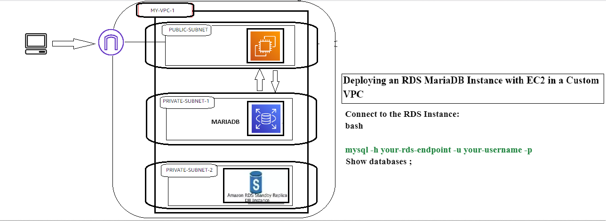

# Deploying an RDS MariaDB Instance with EC2 in a Custom VPC

This project demonstrates how to set up an Amazon RDS database instance with MariaDB and access it from an EC2 instance using a custom VPC configuration. The architecture spans three Availability Zones (AZs), including one public and two private subnets, leveraging the AWS Free Tier.

## 🎯 Objectives

- **Create a Custom VPC**: Set up a VPC with three subnets across different AZs.
- **Deploy EC2 and RDS Instances**: Launch an EC2 instance and an RDS MariaDB instance in the VPC.
- **Configure Network Access**: Ensure secure access between the EC2 instance and the RDS instance.
- **Access RDS from EC2**: Connect to the RDS MariaDB database from the EC2 instance using MariaDB client tools.

## 🏗 Architecture

The architecture includes:

- **VPC**: A custom VPC spanning three Availability Zones.
- **Subnets**:
  - One public subnet for the EC2 instance with internet access.
  - Two private subnets for RDS to enhance security and availability.
- **Internet Gateway**: Provides internet access to the public subnet.
- **NAT Gateway**: Enables instances in the private subnet to access the internet for updates.
- **Route Tables**: Configured for appropriate traffic routing between subnets and to the internet.
- **Security Groups**: Configured to control inbound and outbound traffic to the EC2 and RDS instances.

## 📋 Steps to Deploy the Architecture

### 1. Create a Custom VPC

**Create VPC**:

- Navigate to the VPC dashboard in the AWS Console.
- Create a new VPC with a CIDR block, e.g., `10.0.0.0/16`.

**Create Subnets**:

- **Public Subnet**: Create a public subnet in one AZ (e.g., `10.0.1.0/24`).
- **Private Subnets**: Create two private subnets in different AZs (e.g., `10.0.2.0/24` and `10.0.3.0/24`).

**Create Internet Gateway**:

- Attach an Internet Gateway to the VPC.

**Create a NAT Gateway**:

- Create a NAT Gateway in the public subnet for outbound internet access from private subnets.

**Configure Route Tables**:

- **Public Route Table**: Add a route for internet traffic (`0.0.0.0/0`) to the Internet Gateway.
- **Private Route Table**: Add a route for internet traffic (`0.0.0.0/0`) to the NAT Gateway.

### 2. Launch an EC2 Instance

**Launch EC2 Instance**:

- Choose an Amazon Linux 2 AMI (Free Tier eligible).
- Place it in the public subnet.
- Assign a public IP for internet access.

**Configure Security Group for EC2**:

- Allow inbound SSH access (port 22) from your IP address.
- Allow outbound traffic to the internet.

### 3. Set Up RDS MariaDB Database

**Launch RDS Instance**:

- Choose the MariaDB database engine (Free Tier eligible).
- Select "Do not create" for public accessibility (private access only).
- Place the RDS instance in the two private subnets using subnet groups.

**Configure Security Group for RDS**:

- Allow inbound MariaDB access (port 3306) from the EC2 security group.
- Allow outbound traffic to the internet for updates and patching.

### 4. Use Case Scenario: E-commerce Application

For this setup, we'll assume a simple e-commerce application where the RDS MariaDB database will store information about products, customers, and orders. We'll demonstrate how to use SQL queries to manage and retrieve this data.
